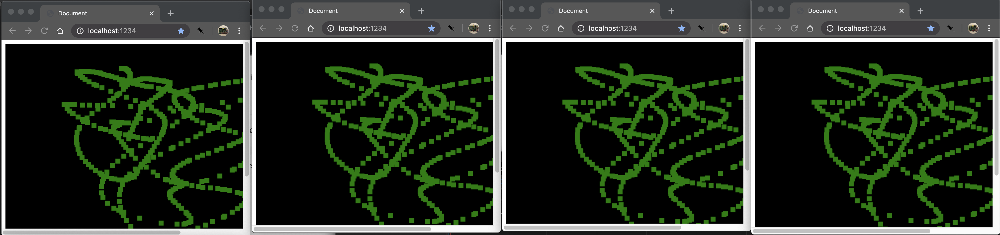

# Play with (Web)Sockets

[Live demo here][demo-app]

Experimenting with web sockets. Currently, there is a node server and react client that allow many browsers to manipulate a canvas and sync the state to all that are connected.

## Setup

Using websockets does require having TLS configured. You will need to create a cert/key for localhost and update the server `index.ts` accordingly.

[demo-app]: https://sockets.jacobx1.dev/
